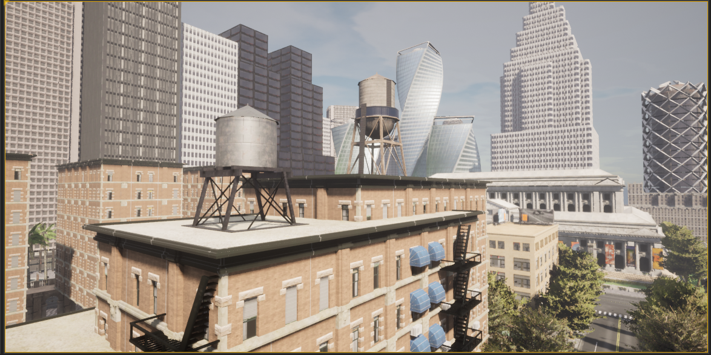

Adding a new vehicle in CARLA UnrealEngine 4

----

Initial Setup

""""

.. note:: If you ran the bash script "install_ros_carla_ue4.sh" then all the folders are setup for you automatically. You can skip to the next section if not, follow this guiide to setup the vehicle assets and blueprints in the right folders of CARLA.

1. Unzip the Mustang_Mache.zip file to the ~/carla/Unreal/CarlaUE4/Content/Carla/Static/Vehicles/4Wheeled folder. This contains all the physics asset and the skeletal mesh of the car.

2. Unzip the Mustang_MachE_Blueprint.zip file to the ~/carla/Unreal/CarlaUE4/Content/Carla/Blueprints/Vehicles folder. This is the core blueprint of the vehicle that UnrealEngine can read and the CARLA simulator can use to render and spawn the vehicle model.

Getting The Settings Just Right

""""

.. image:: folder_and_scene_setup.png

1. If you have followed the above steps or manually unzipped the file to the right folders then your workspace should look like the image above. Your scene in the editor may vary but your folder structure should be exactly the same as above.

.. image:: car_physics_icon.png

2. Double click on the icon show above in the folder to open the physics asset of the car. This should open a new window that should look like below

3. If you do not see the collison box around the car and the spherical collision shapes around the wheels then you will have to add it manually. To do that follow the image below

This should add a box to the vehicle. You will need to resize the box to fit the car. It won't be an exact fit so you will have to make it fit as best as you can. You can do so by using your mouse. The options to move, rotate and resize the box is given in on the top right of the car. See the image below

.. image:: move _rotate_resize.png

You can rotate the view by clicking the right mouse button and dragging your mouse. You can also move around using the WASD and arrow keys as well.
While trying to change the shape, size and orientation of the collision box you will get a set of coordinate axes representing X, Y and Z respectively, it is highly recommended to only move, rotate or resize them one axis at a time.

You will have to rotate the view of the car itself a few times to make sure the collision box fits the car as best as it can.

4. Right click on the root as shown in step 3 and now add a sphere, for the wheels of the car. The sphere can be too big to fit so use the resize option as shwon in step 3 to resize the sphere and make it as small as possible. After this you will need to fit the sphere to the wheel of the car as best as you can. Following the same steps as before. You will need to repeat this step three more times so that each wheel of the car has a collision sphere on it.

.. warning:: The most important thing is to make the collision box of the car be above the collision spheres of the wheels. If you have to add the collision boxes and spheres manually, please make sure it is as close to what is shown in step 2 above. 

5. After you have added all the collision boxes and spheres around the car, you will need to select any one of the collision shapes a menu will open on the right as shown below. You will need to make the physics type of the shape to "Kinematic" as shown below.

.. image:: physcis_type_kinematic.png

6. Next you will have to check the box Under collision tab that says Simulation Generates Hit Events as shown below.

7. After all the above steps, click save on the top left and close the window.

8. After the above steps go to the Mustang_MachE folder in the blueprints folder as shown in the image below inside UnrealEngine.

.. image:: blueprints_folder.png

9. Double click the Blueprint icon with the name BP_Mustang_MachE as shown below.

10. In the scale option set all the values to 0.2 as shown below.

.. image::  scale_image.png

11. Hit compile and save buttons on top right and close the window. The car now be spawned without any collision detection errors.

.. warning:: Step 10 and step 12 are extremely important. If you do not scale the car blueprint as shown in step 10, you will get an error that says "Invalid spawn point. Collision Detected" when you try to spawn the car using the PythonAPI. In step 11 we need to add our car to the VehicleFactory, which is responsible for spawning all the vehicles in the simualtion. If you do not add the vehicles to the VehicleFactory then the vehicle will NOT spawn. 

12. Go to the VehicleFactory icon and double click it in the Content Browser as shown below.

12. This will open up a window that looks like below. Zoom in until you can see the vehcile factory node in the graph.

13. Click the Vehicle Factory node which will open up a menu on the right. Click on the plus icon as shown below to add a new vehicle.

14. Scroll down all the way to the last element of the list and click the drop down. Make sure all the variables look exactly as shown below to add the Mustang Mach E to the Vehicle Factory to be able to spawn the car in simulation. 

.. image:: mustang_vf_settings.png 

15. Hit compile and save on the top left and close the window.

16. Copy all python files in the folder ~/environment_setup/custom_python_code folder to ~/carla/PythonAPI/examples folder.

Spawning The Car In The Simulation 
""""

.. note:: You will need multiple terminals to perform the following steps. I recommend using terminator. It can installed with sudo apt install terminator -y. You will also need to ensure that your simulation is running for all the steps after step 1.

1. Open the ~/carla folder in a terminal and run the command below to launch CarlaUnrealEngine if you have not already. If you have CarlaUnrealEngine already running skip this step.

.. code:: console

    make launch

2. Once UnrealEngine is up and running hit the play button on the top of the screen to start the simulation. You will know the simulation is running when the camera is now in a different location and the play button has turned into a pause button as shown below.

.. image:: simulation_started.png

3. Open another terminal and go to ~/carla/PythonAPI/examples folder. 

4. To get all the possible spawn points for the car on the map run the get_spawn_points.py in the new terminal by using the following command:

.. code:: console

    python get_spawn_points.py

The output of the above code is to get a list of all the possible spawn points on the map. It should look something like this

.. image:: get_spawn_points_output.png

By default, the first spawn point of this output is chosen for the car to spawn.

5. In the same terminal or a new terminal run the vehicle_spawn.py python script to spawn the car in the simulation.

.. warning:: The spawn point chosen is NOT where the camera is when the simulation is running. You will need to manually move the camera to the spot where the car is spawned.

6. To see the car spawned in the simulation you will have to manually move the camera to the location in the simulation inside UnrealEngine.

7. You can use the mouse and the arrow keys and the WASD keys to do so. You will need to click the simulation and then use the WASD keys to move the camera inside the simulation. 

8. The starting point of the camera is shown below.

9. Click the mouse on the simualtion and the cursor will disappear, then you can move the camera with WASD. Move the camera straight by pressing and holding the W key. Until you reach the spot shown by the image below

10. Then hold the right mouse button and orient the camera towards the white building shown below and then press W key until you reach till the image below.

.. image:: white_building.png

11. Pan the camera to the left using the right mouse button and dragging the mouse. Then press W until you reach the spot as shown in the below image

12. Now with this viewing angle, open another terminal. Drag the window of the terminal to the bottom so that you can see the spawn point clearly. Then run the command below in the terminal

.. code:: console

    python vehicle_spawn.py

13. When the above command is run the vehicle will spawn at the spawn point shown that was given in "vehicle_spawn.py" file. The spawn point can be changed by replacing the "Transform(Location(x=106.513153, y=-21.554596, z=0), Rotation(pitch=0.000000, yaw=-91.519577, roll=0.000000))" with any one of the outputs from get_spawn_points.py file. But this will spawn the vehicle in a different spawn point.

14. Alternatively, if you do not want to physically move the camera to the spawn point everytime, you can drive to the spawn point in a different car and see that the Mustang Mach E has spawned at the location. To do so, open a new terminal and run the following command

.. code:: console

    python manual_control.py

This will open a pygame window and a vehicle. Use backspace to change the vehicle used, WASD to move the vehicle around the simulation. 

Alternatively you can use the --filter tag with manual_control.py to use a car of your choice with the command 

.. code:: console

    python manual_control.py --filter cybertruck

The above code will spawn a Tesla Cybertruck that can be driven around in the simulation and interact with the Mustang Mach E.