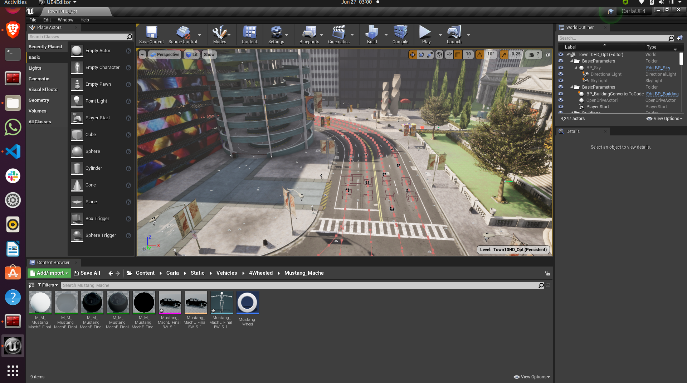
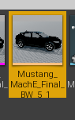
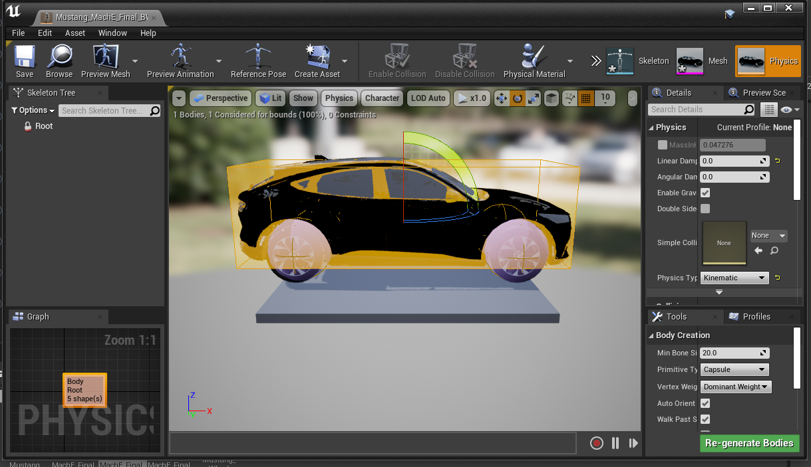
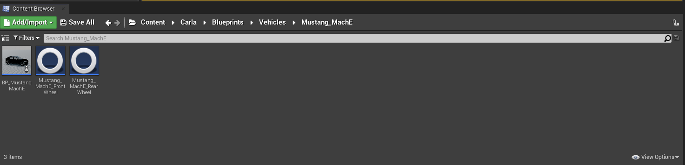
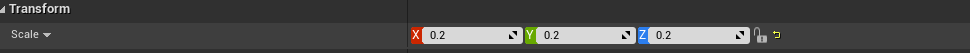
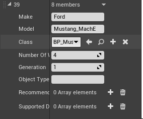
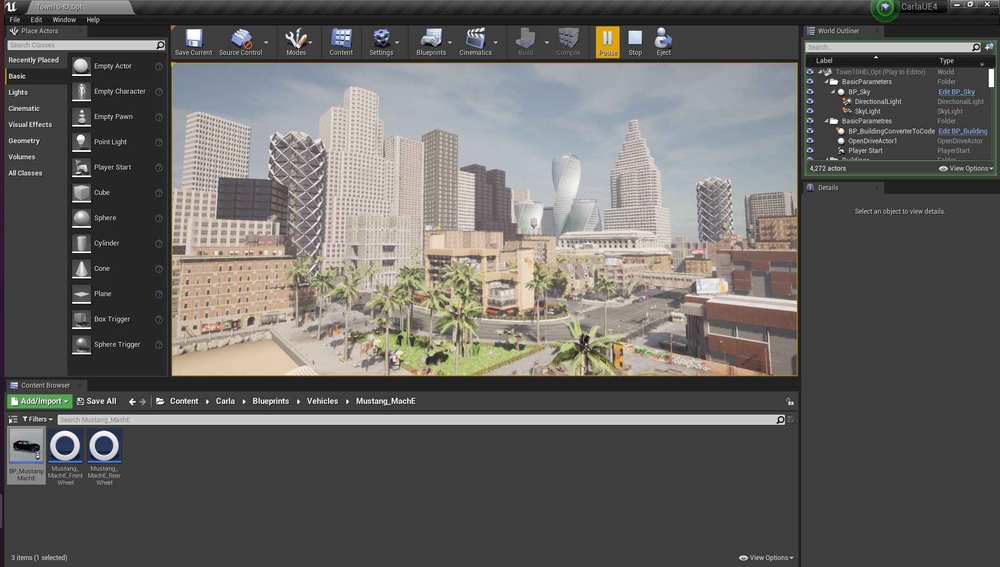
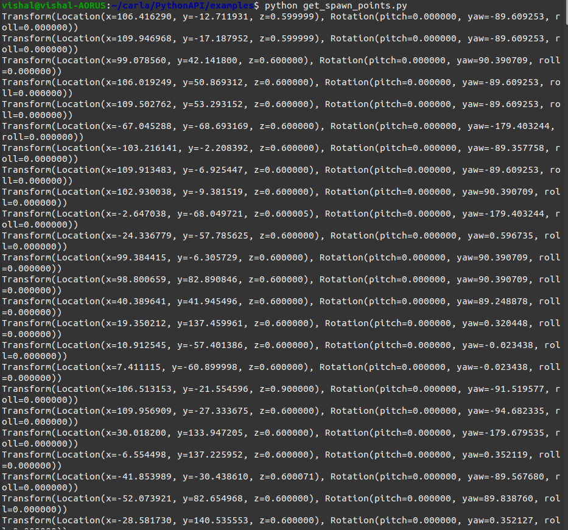
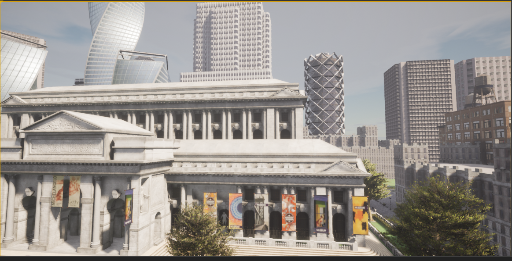

Installation
----

ROS2 Galactic Installation
""""

To use the software, first install ROS2 Galactic on your Ubuntu 20.04 desktop environment.

.. code-block:: console

   sudo apt install software-properties-common
   sudo add-apt-repository universe
   sudo apt update && sudo apt install curl gnupg lsb-release
   sudo curl -sSL https://raw.githubusercontent.com/ros/rosdistro/master/ros.key -o /usr/share/keyrings/ros-archive-keyring.gpg
   echo "deb [arch=$(dpkg --print-architecture) signed-by=/usr/share/keyrings/ros-archive-keyring.gpg] http://packages.ros.org/ros2/ubuntu $(source /etc/os-release && echo $UBUNTU_CODENAME) main" | sudo tee /etc/apt/sources.list.d/ros2.list > /dev/null
   sudo apt update # update your apt repo caches
   sudo apt install ros-galactic-desktop

Then source the setup of ROS2 on bash by running the following commands:

.. code-block:: console

   source /opt/ros/galactic/setup.bash
   echo "source /opt/ros/galactic/setup.bash" >> ~/.bashrc
   source ~/.bashrc

Run Some Examples
""""
To verify that ROS2 Galactic has been installed properly run the following commands:

.. code-block:: console

   ros2 run demo_nodes_cpp talker

The output should confirm that the talker is successfully publishing messages:

.. code-block:: console

   [INFO] [1652382860.246687611] [talker]: Publishing: 'Hello World: 1'
   [INFO] [1652382861.250208871] [talker]: Publishing: 'Hello World: 2'
   [INFO] [1652382862.246508551] [talker]: Publishing: 'Hello World: 3'
   ...

In another terminal window, run the example Python listener

.. code-block:: console

   ros2 run demo_nodes_py listener
   
The output should confirm that the listener is hearing the published messages:

.. code-block:: console

   [INFO] [1652382936.495044030] [listener]: I heard: [Hello World: 1]
   [INFO] [1652382937.478216343] [listener]: I heard: [Hello World: 2]
   [INFO] [1652382938.487370309] [listener]: I heard: [Hello World: 3]
   ...

If all the above steps worked and the listener node is printing messages to your console in sync with the talker node publishing them, ROS2 has been successfully installed.

.. note:: 
   
   Clone this repository before proceeding with next steps:

   .. code-block:: console

      cd ~/
      git clone https://github.com/VishalNadig/BELIV.git

UnrealEngine Setup
""""

1) Please visit: `Unreal Engine <https://www.unrealengine.com/en-US/ue-on-github>`_ for steps to get access to the UnrealEngine repository.
2) Clone the `Unreal Engine For CARLA GitHub <https://github.com/CarlaUnreal/UnrealEngine>`_ and check if you can see the UnrealEngine Repository.

.. code-block:: console
   
   cd ~/
   git clone https://github.com/CarlaUnreal/UnrealEngine
   cd ~/UnrealEngine

3) Then setup the UnrealEngine using the following commands:

.. code-block:: console

   ./Setup.sh && ./GenerateProjectFiles.sh && make
   mv ~/UnrealEngine ~/UnrealEngine-4.26

The installation takes over an hour or two to finish. Might be slower if your laptop has lower end specs.

4) Add UnrealEngine to environment variables

.. code-block:: console

   gedit ~/.bashrc

5) In the last line of the .bashrc file, write

.. code-block:: console

   export UE4_ROOT=~/UnrealEngine-4.26

Install and Build CARLA
""""

1) Downloading aria2 will speed up the following commands.

.. code-block:: console

   sudo apt-get install aria2

2) Install Ninja tool and clang-8 required to build the PythonAPI and the important python libraries using:

.. code-block:: console

   sudo apt install ninja-build
   sudo apt install clang-8
   pip install --user setuptools && pip3 install --user -Iv setuptools==67.8.0 && pip install --user distro && pip3 install --user distro && pip install --user wheel && pip3 install --user wheel auditwheel
   sudo apt install clang

3) Clone the CARLA repository found here: `CARLA GitHub <https://github.com/carla-simulator/carla.git>`_ into your home directory.
Then go into the carla repository that was just cloned and get the latest assets.

.. code-block:: console
   
   cd ~/
   git clone https://github.com/carla-simulator/carla.git
   cd ~/carla
   git checkout 0.9.13
   ./Update.sh

4) Compile the Python API client:

The Python API client grants control over the simulation. Compilation of the Python API client is required the first time you build CARLA and again after you perform any updates. After the client is compiled, you will be able to run scripts to interact with the simulation.

The following command compiles the Python API client:

.. code-block:: console

    make PythonAPI

While the above make command is running if you encounter a 404 not found error while downloading xerces-c3.2.3 then do the following, if not then skip this and go to step 5.
If xerces-c3.2.3 cannot be downloaded because of a 404 not found error then comment the following line found in line 432 in ~/carla/Util/BuildTools/Setup.sh

.. code-block:: console

   "XERCESC_REPO=https://ftp.cixug.es/apache//xerces/c/3/sources/xerces-c-${XERCESC_VERSION}.tar.gz"

and add the following line below it and run "make PythonAPI" from above command again

.. code-block:: console

   "XERCESC_REPO=https://archive.apache.org/dist/xerces/c/3/sources/xerces-c-${XERCESC_VERSION}.tar.gz"

5) Copy the carla-0.9.13-py3.7-linux-x86_64.egg file from BELIV/ to carla/PythonAPI/ folder.

.. code-block:: console

   cp ~/BELIV/carla-0.9.13-py3.7-linux-x86_64.egg ~/carla/PythonAPI/

6) Edit the .bashrc file to export the above .egg file to the PYTHONPATH variable:

.. code-block:: console

    echo "export PYTHONPATH=$PYTHONPATH:~/carla/PythonAPI/carla-0.9.13-py3.7-linux-x86_64.egg" >> ~/.bashrc

7) Compile the server:

The following command compiles and launches Unreal Engine. Run this command each time you want to launch the server or use the Unreal Engine editor:

.. code-block:: console

    make launch
    
The project may ask to build other instances such as UE4Editor-Carla.dll the first time. Agree in order to open the project. During the first launch, the editor may show warnings regarding shaders and mesh distance fields. These take some time to be loaded and the map will not show properly until then.

8) Go to the Edit>Editor Preferences option on the top left of the UnrealEngine Editor and go to Performance option on the left hand side of the screen. Uncheck "Use Less CPU when in background" option and close the Editor Preferences window. Now hit the Play button on the top of the UnrealEngine editor and wait for the simulation to start.

9) Open a new terminal by pressing Ctrl+Alt+T on the keyboard and navigate to the PythonAPI examples directory and run python examples:

.. code-block:: console

   cd ~/carla/PythonAPI/examples
   python3 dynamic_weather.py

This should change the weather in the simulation running in the UnrealEngine Editor. Weather effects such as cloudy and rain as well as change of day will occur.

10) Open a new terminal by pressing Ctrl+Alt+T on the keyboard and navigate to the PythonAPI examples directory and run python examples:

.. code-block:: console

   cd ~/carla/PythonAPI/examples
   python3 manual_control.py

The above command will open a seperate pygame window that will let you drive a car around the simulation. The pygame window represents a small portion of the simulation running in the UnrealEngine editor. Press ESC on the terminal on which the python3 manual_control.py was run to close the pygame window.

Troubleshooting
""""

If the simulation is bluish and and the colors are washed out or have a bright white hue to them and you have an Nvidia Graphic card then run the following
Verify that you have a Nvidia Graphic Card

.. code-block:: console

   lspci | grep -i nvidia

If you can see the words "Nvidia Controller" and the word Nvidia highlighted in red then you have an Nvidia graphic card. 

Download the drivers for Nvidia graphic card by running the following commands.

.. code-block:: console
   
   wget https://developer.download.nvidia.com/compute/cuda/repos/ubuntu2004/x86_64/cuda-ubuntu2004.pin
   sudo mv cuda-ubuntu2004.pin /etc/apt/preferences.d/cuda-repository-pin-600
   wget https://developer.download.nvidia.com/compute/cuda/12.1.1/local_installers/cuda-repo-ubuntu2004-12-1-local_12.1.1-530.30.02-1_amd64.deb
   sudo dpkg -i cuda-repo-ubuntu2004-12-1-local_12.1.1-530.30.02-1_amd64.deb
   sudo cp /var/cuda-repo-ubuntu2004-12-1-local/cuda-*-keyring.gpg /usr/share/keyrings/
   sudo apt-get update
   sudo apt-get -y install cuda

After the above steps restart your computer and the run the below command to verify that the drivers were updated successfully

.. code-block:: console
   
   nvidia-smi

CARLA in Docker
""""

To install CARLA in docker environment you will need two things:
   1) Docker
   2) Nvdia-Container-Toolkit

Docker Installation
''''

.. code-block:: console

   sudo apt-get remove docker docker-engine docker.io
   sudo apt-get update
   sudo apt install docker.io -y
   sudo snap install docker

Verify that docker was successfully installed on your system by running:

.. code-block:: console

   docker --version

Add docker to sudo group to avoid using sudo everytime to run docker commands:

.. code-block:: console

   sudo groupadd docker
   sudo usermod -aG docker $USER

Nvidia-Container-Toolkit Installation
''''
Nvidia Container Toolkit to give access to Linux Containers to the GPUs.

Add the nvidia-container-toolkit to apt list

.. code-block:: console

   distribution=$(. /etc/os-release;echo $ID$VERSION_ID) \
   && curl -fsSL https://nvidia.github.io/libnvidia-container/gpgkey | sudo gpg --dearmor -o /usr/share/keyrings/nvidia-container-toolkit-keyring.gpg \
   && curl -s -L https://nvidia.github.io/libnvidia-container/$distribution/libnvidia-container.list | \
         sed 's#deb https://#deb [signed-by=/usr/share/keyrings/nvidia-container-toolkit-keyring.gpg] https://#g' | \
         sudo tee /etc/apt/sources.list.d/nvidia-container-toolkit.list

Update the sources list of apt to include the installation of nvidia-container-toolkit

.. code-block:: console

      sudo apt update

Install nvidia-container-toolkit

.. code-block:: console

      sudo apt install -y nvidia-container-toolkit

Adding a new vehicle in CARLA UnrealEngine 4

----

Initial Setup

""""

.. note:: If you ran the bash script "install_ros_carla_ue4.sh" then all the folders are setup for you automatically. You can skip to the next section if not, follow this guiide to setup the vehicle assets and blueprints in the right folders of CARLA.

1. Unzip the Mustang_Mache.zip file to the ~/carla/Unreal/CarlaUE4/Content/Carla/Static/Vehicles/4Wheeled folder. This contains all the physics asset and the skeletal mesh of the car.

2. Unzip the Mustang_MachE_Blueprint.zip file to the ~/carla/Unreal/CarlaUE4/Content/Carla/Blueprints/Vehicles folder. This is the core blueprint of the vehicle that UnrealEngine can read and the CARLA simulator can use to render and spawn the vehicle model.

Getting The Settings Just Right

""""

1. If you have followed the above steps or manually unzipped the file to the right folders then your workspace should look like the image above. Your scene in the editor may vary but your folder structure should be exactly the same as above.

2. Double click on the icon show above in the folder to open the physics asset of the car. This should open a new window that should look like below

.. image:: car_collision_model.png

3. If you do not see the collison box around the car and the spherical collision shapes around the wheels then you will have to add it manually. To do that follow the image below

.. image:: add_box_collision.png

This should add a box to the vehicle. You will need to resize the box to fit the car. It won't be an exact fit so you will have to make it fit as best as you can. You can do so by using your mouse. The options to move, rotate and resize the box is given in on the top right of the car. See the image below

.. image:: move _rotate_resize.png

You can rotate the view by clicking the right mouse button and dragging your mouse. You can also move around using the WASD and arrow keys as well.
While trying to change the shape, size and orientation of the collision box you will get a set of coordinate axes representing X, Y and Z respectively, it is highly recommended to only move, rotate or resize them one axis at a time.

You will have to rotate the view of the car itself a few times to make sure the collision box fits the car as best as it can.

4. Right click on the root as shown in step 3 and now add a sphere, for the wheels of the car. The sphere can be too big to fit so use the resize option as shwon in step 3 to resize the sphere and make it as small as possible. After this you will need to fit the sphere to the wheel of the car as best as you can. Following the same steps as before. You will need to repeat this step three more times so that each wheel of the car has a collision sphere on it.

.. warning:: The most important thing is to make the collision box of the car be above the collision spheres of the wheels. If you have to add the collision boxes and spheres manually, please make sure it is as close to what is shown in step 2 above. 

5. After you have added all the collision boxes and spheres around the car, you will need to select any one of the collision shapes a menu will open on the right as shown below. You will need to make the physics type of the shape to "Kinematic" as shown below.

6. Next you will have to check the box Under collision tab that says Simulation Generates Hit Events as shown below.

.. image:: simulation_generates_collision.png 

7. After all the above steps, click save on the top left and close the window.

8. After the above steps go to the Mustang_MachE folder in the blueprints folder as shown in the image below inside UnrealEngine.

9. Double click the Blueprint icon with the name BP_Mustang_MachE as shown below.

.. image::  blueprints_icon.png

10. In the scale option set all the values to 0.2 as shown below.

11. Hit compile and save buttons on top right and close the window. The car now be spawned without any collision detection errors.

.. warning:: Step 10 and step 12 are extremely important. If you do not scale the car blueprint as shown in step 10, you will get an error that says "Invalid spawn point. Collision Detected" when you try to spawn the car using the PythonAPI. In step 11 we need to add our car to the VehicleFactory, which is responsible for spawning all the vehicles in the simualtion. If you do not add the vehicles to the VehicleFactory then the vehicle will NOT spawn. 

12. Go to the VehicleFactory icon and double click it in the Content Browser as shown below.

.. image:: vehicle_factory_icon.png 

12. This will open up a window that looks like below. Zoom in until you can see the vehcile factory node in the graph.

.. image:: vehicle_factory_node.png

13. Click the Vehicle Factory node which will open up a menu on the right. Click on the plus icon as shown below to add a new vehicle.

.. image:: add_new_vehicle_vf.png

14. Scroll down all the way to the last element of the list and click the drop down. Make sure all the variables look exactly as shown below to add the Mustang Mach E to the Vehicle Factory to be able to spawn the car in simulation. 

15. Hit compile and save on the top left and close the window.

16. Copy all python files in the folder ~/environment_setup/custom_python_code folder to ~/carla/PythonAPI/examples folder.

Spawning The Car In The Simulation 
""""

.. note:: You will need multiple terminals to perform the following steps. I recommend using terminator. It can installed with sudo apt install terminator -y. You will also need to ensure that your simulation is running for all the steps after step 1.

1. Open the ~/carla folder in a terminal and run the command below to launch CarlaUnrealEngine if you have not already. If you have CarlaUnrealEngine already running skip this step.

.. code:: console

    make launch

2. Once UnrealEngine is up and running hit the play button on the top of the screen to start the simulation. You will know the simulation is running when the camera is now in a different location and the play button has turned into a pause button as shown below.

3. Open another terminal and go to ~/carla/PythonAPI/examples folder. 

4. To get all the possible spawn points for the car on the map run the get_spawn_points.py in the new terminal by using the following command:

.. code:: console

    python get_spawn_points.py

The output of the above code is to get a list of all the possible spawn points on the map. It should look something like this

By default, the first spawn point of this output is chosen for the car to spawn.

5. In the same terminal or a new terminal run the vehicle_spawn.py python script to spawn the car in the simulation.

.. warning:: The spawn point chosen is NOT where the camera is when the simulation is running. You will need to manually move the camera to the spot where the car is spawned.

6. To see the car spawned in the simulation you will have to manually move the camera to the location in the simulation inside UnrealEngine.

7. You can use the mouse and the arrow keys and the WASD keys to do so. You will need to click the simulation and then use the WASD keys to move the camera inside the simulation. 

8. The starting point of the camera is shown below.

9. Click the mouse on the simualtion and the cursor will disappear, then you can move the camera with WASD. Move the camera straight by pressing and holding the W key. Until you reach the spot shown by the image below

.. image:: camera_movement_1.png

10. Then hold the right mouse button and orient the camera towards the white building shown below and then press W key until you reach till the image below.

11. Pan the camera to the left using the right mouse button and dragging the mouse. Then press W until you reach the spot as shown in the below image

.. image:: pan_before_spawn.png

12. Now with this viewing angle, open another terminal. Drag the window of the terminal to the bottom so that you can see the spawn point clearly. Then run the command below in the terminal

.. code:: console

    python vehicle_spawn.py

13. When the above command is run the vehicle will spawn at the spawn point shown that was given in "vehicle_spawn.py" file. The spawn point can be changed by replacing the "Transform(Location(x=106.513153, y=-21.554596, z=0), Rotation(pitch=0.000000, yaw=-91.519577, roll=0.000000))" with any one of the outputs from get_spawn_points.py file. But this will spawn the vehicle in a different spawn point.

14. Alternatively, if you do not want to physically move the camera to the spawn point everytime, you can drive to the spawn point in a different car and see that the Mustang Mach E has spawned at the location. To do so, open a new terminal and run the following command

.. code:: console

    python manual_control.py

This will open a pygame window and a vehicle. Use backspace to change the vehicle used, WASD to move the vehicle around the simulation. 

Alternatively you can use the --filter tag with manual_control.py to use a car of your choice with the command 

.. code:: console

    python manual_control.py --filter cybertruck

The above code will spawn a Tesla Cybertruck that can be driven around in the simulation and interact with the Mustang Mach E.

